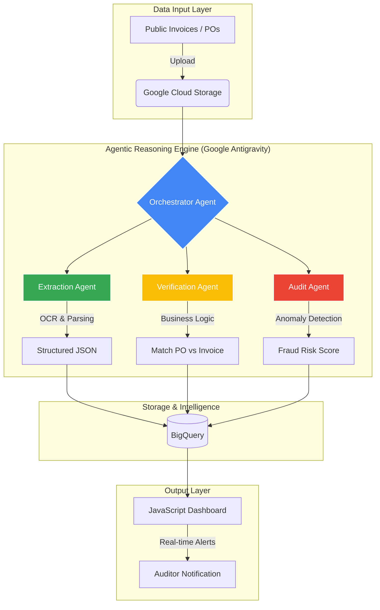

# VerifiX: Agentic Document Verification & Audit

**VerifiX** is an AI-powered multi-agent system designed to automate the verification of public procurement documents. Developed during the **2025 Google Agentathon**, it solves the "manual audit" bottleneck by using intelligent agents to cross-reference **Invoices** against **Purchase Orders (POs)** to detect fraud, waste, and non-compliance.

---

## 🚀 The Problem
In public sector auditing, manually verifying thousands of documents is impossible, leading to:
* **Duplicate Payments:** Multiple invoices processed for a single PO.
* **Price Variance:** Invoices charging higher rates than agreed upon in the PO.
* **Compliance Gaps:** Missing GSTIN, invalid headers, or incorrect tax calculations.

## 🤖 Our Agentic Solution
VerifiX uses a **Multi-Agent Architecture** to move beyond simple OCR. Our agents reason through data:

1.  **Extraction Agent:** Converts unstructured PDFs/Images into structured JSON using **Gemini 1.5 Flash**.
2.  **Verification Agent:** Performs logical cross-checks between PO line items and Invoice data.
3.  **Audit Agent:** Analyzes the delta, flags anomalies, and assigns a **Fraud Risk Score**.

---

## 🏗️ System Architecture

## 🛠️ Tech Stack
Platform: Google Antigravity (Agent-first IDE)

AI Models: Google Vertex AI (Gemini 1.5 Pro & Flash)

Cloud Infrastructure: Google Cloud Run, BigQuery, Cloud Storage

Languages: Python (Backend Logic), JavaScript (Frontend Audit Dashboard)

## 📦 Getting Started
Prerequisites
Google Cloud Project ID

Python 3.9 or higher

GCP Service Account with BigQuery Admin and Storage Admin roles

## Installation
Clone the repository:

git clone [https://github.com/divyasrinallatigala/VerifiX.git](https://github.com/divyasrinallatigala/VerifiX.git)

cd VerifiX

Install dependencies:

pip install -r requirements.txt

Set Environment Variables: Create a .env file in the root directory:

PROJECT_ID="your-google-cloud-project-id"

REGION="us-central1"

BUCKET_NAME="your-invoice-bucket"
